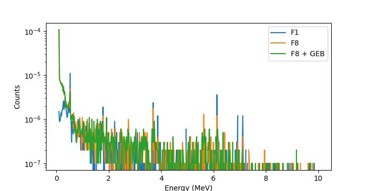
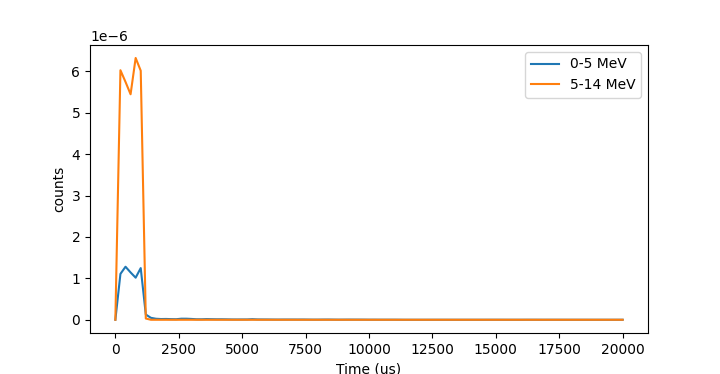

# Examples

For examples using the command line, see the [Comand Line Interface](cli.rst).

## Loading a file

    import pymcnp
	
	filename = "/path/to/data/input.i'
	data = pymcnp.read_input(filename)

## Loading a file, modyfing it and saving it again

We load a file and change the number of particles to 100,000. Here, we
use the universal `modify` function.

    import pymcnp
	
	filename = "/path/to/data/input.i'
	data = pymcnp.read_input(filename)
	
	pymcnp.modify(x.data.card_s['nps'], npp=100_000)

	data.to_mcnp_file('/path/to/data/new_file_name.i')

However, dor common operations, we have specific helper functions, so
the above can also be done using:

    import pymcnp
	
	filename = "/path/to/data/input.i'
	data = pymcnp.read_input(filename)
	
	data = data.set_nps(100_000)

	data.to_mcnp_file('/path/to/data/new_file_name.i')

## Creating materials using chemical formula

Creating a material input for water:

    water = pymcnp.inp.Material.from_formula(
        0,
        {'H2O': 1},
        atomic_or_weight=True,
    )
    print(water.to_mcnp())

Will result in:

    m0 001001 -0.1118855432927602 $ H-001
       001002 -1.2868317335160966e-05 $ H-002
       008016 -0.8859435015301171 $ O-016
       008017 -0.00033747860358816377 $ O-017
       008018 -0.0018206082561993046 $ O-018

Using a combination of more complicated materials:

    clinker_concrete = pymcnp.inp.Material.from_formula(
        1,
        {
            'Ca3Al2O6': 0.100,
            'Ca4Al2Fe2O10': 0.080,
            'Ca2SiO5': 0.200,
            'Ca3SiO4': 0.550,
            'Na2O': 0.010,
            'K2O': 0.010,
            'CaSO4H4O2': 0.050,
        },
        atomic_or_weight=False,
    )
    print(clinker_concrete.to_mcnp())

Will result in:

    m1 013027 0.01997201102245584 $ Al-027
       020040 0.043137987745945364 $ Ca-040
       020042 0.00028790994596328333 $ Ca-042
       020043 6.007394544828941e-05 $ Ca-043
       020044 0.0009282537052231979 $ Ca-044
       020046 1.77996875402339e-06 $ Ca-046
       020048 8.321353925059347e-05 $ Ca-048
       008016 0.03544243521555091 $ O-016
       008017 1.3500932648244581e-05 $ O-017
       ...

## Reading output files

The following examples are also provided as python files in the git
repo 'example' folder.

### F1 and F8 tallies

To read tally data, we read in the output file. This creates a data
frame that tells us how many tallies are available. We can then load
the data of a specific one and easily plot it.

    file = "data/output_files/F1F8.o"
    out = pymcnp.outp.ReadOutput(file)
    print(out.get_runtime())
    
    # store tally information
    df_info = out.df_info
    print(df_info.head(5))
    
    # Based on df_info, choose desired tally
    df1 = out.read_tally(n=1)
    print(df1.head(5))
    
    df8 = out.read_tally(n=6)
    df18 = out.read_tally(n=7)
    
    plt.figure()
    plt.plot(df1["energy"], df1["cts"], label="F1")
    plt.plot(df18["energy"], df18["cts"], label="F8")
    plt.plot(df8["energy"], df8["cts"], label="F8 + GEB")
    plt.xlabel("Energy (MeV)")
    plt.ylabel("Counts")
    plt.yscale("log")
    plt.legend()
    plt.show()

Creates the following image:

### Energy and time

    file = "data/output_files/png_e.o"
    out = pymcnp.outp.ReadOutput(file)
    
    # information about tallies found
    dfi = out.df_info
    df_err, df = out.read_tally(n=0, mode="te")
    
    df5 = df.loc[1][1:]  # between 0-5 MeV
    df14 = df.loc[2][1:]  # between 5-14 MeV
    plt.figure()
    plt.plot(df5.index, df5, label="0-5 MeV")
    plt.plot(df14.index, df14, label="5-14 MeV")
    plt.xlabel("Time (us)")
    plt.ylabel("counts")
    plt.legend()
    plt.show()

Creates the following image:

