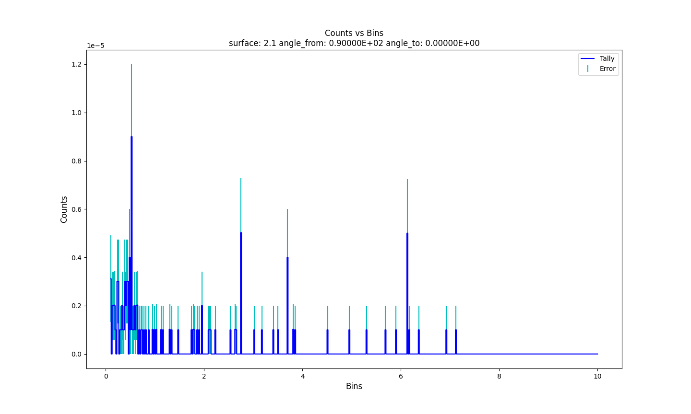
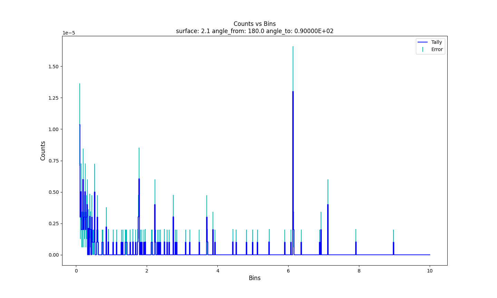
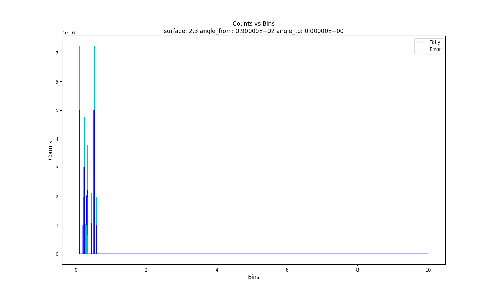
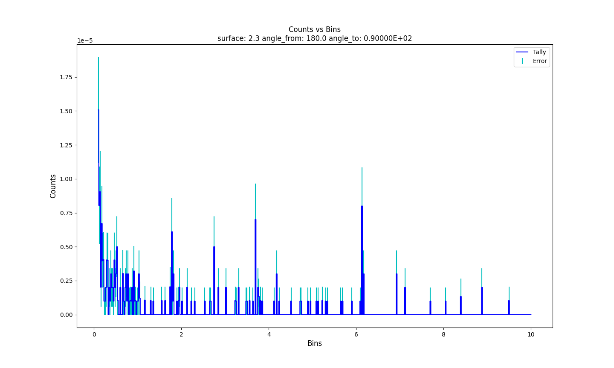
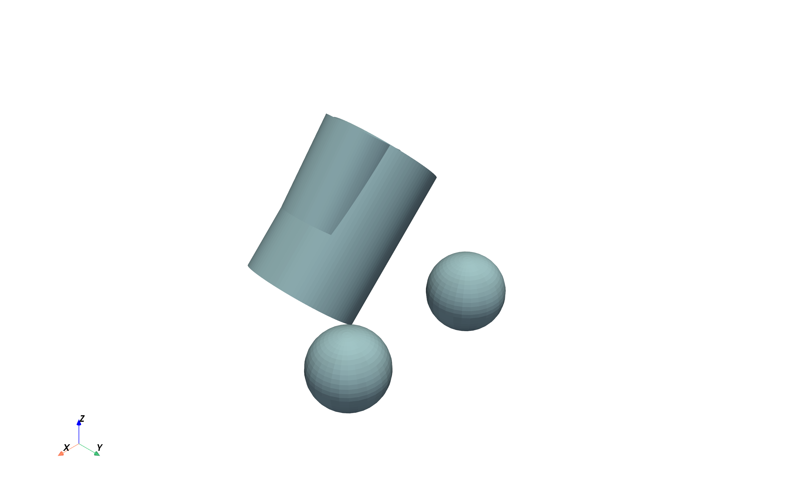
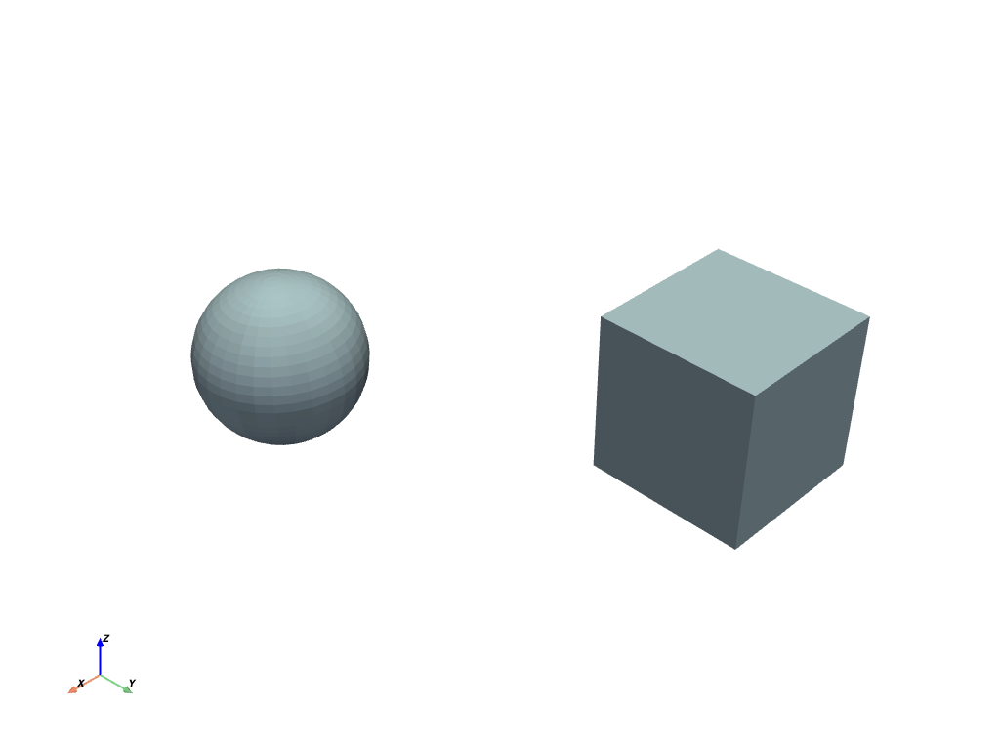
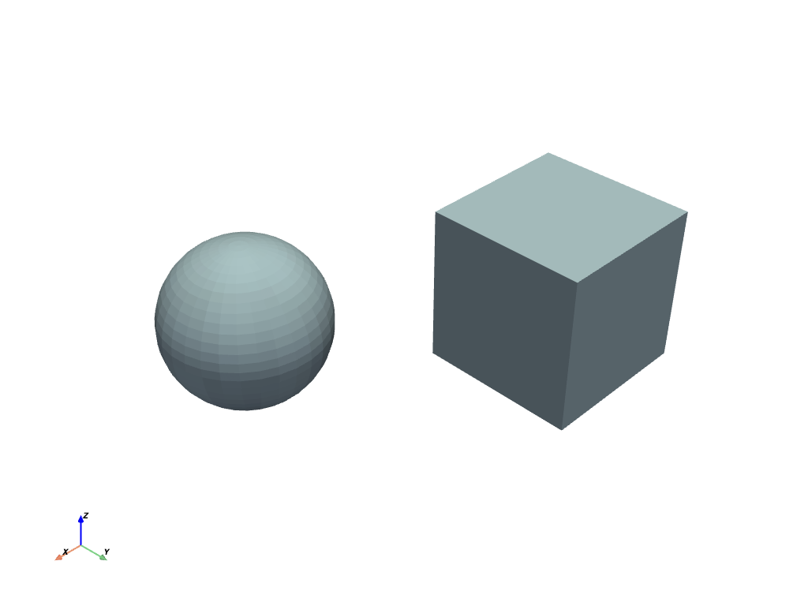
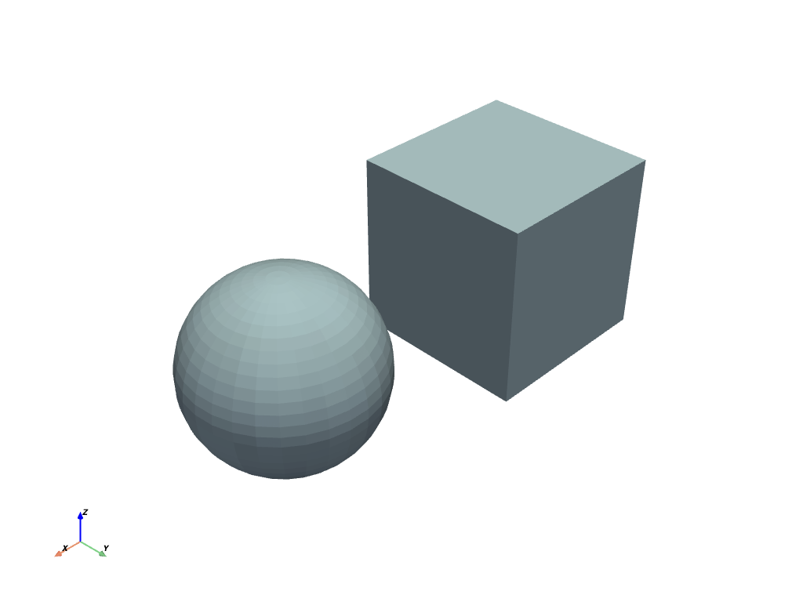
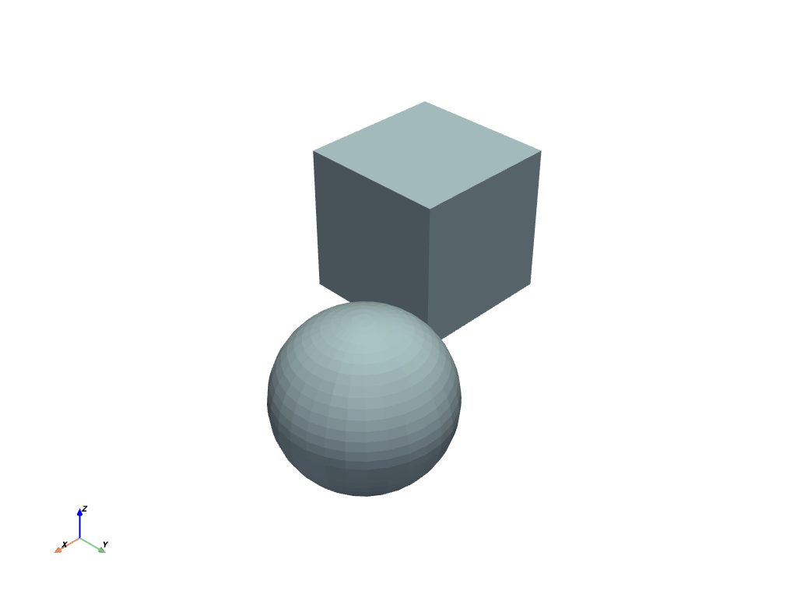
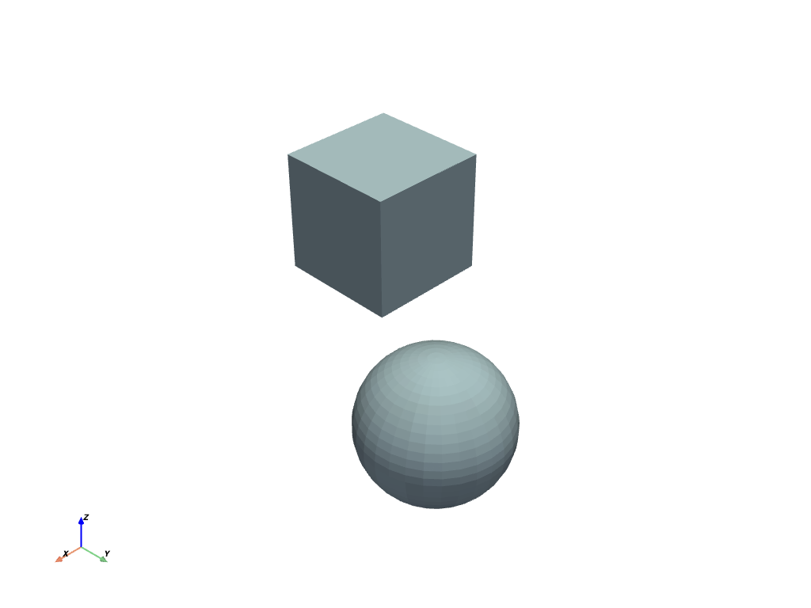

# "Do" Examples

PyMCNP enables common workflows using `pyvista`, `pandas`, `subprocesss`, `matplotlib`, and `difflib`.

## Checking INP Files

```{eval-rst}
.. note:: 
   This example requires `example_00.inp <https://github.com/FSIBT/PyMCNP/blob/master/examples/example_00.inp>`_.
```

Code:

```{eval-rst}
.. literalinclude:: ../../../examples/do_check.py
   :language: python
```

Output:

    Checking INP file: `example_00.inp`
    Fixing and writing to INP file: `example_00.inp`

## Converting OUTP Files

```{eval-rst}
.. note:: 
   This example requires `example_00.outp <https://github.com/FSIBT/PyMCNP/blob/master/examples/example_00.outp>`_.
```

Code:

```{eval-rst}
.. literalinclude:: ../../../examples/do_convert.py
   :language: python
```

Output:

    Converting tally #1 from `PyMCNP/files/outp/example_00.outp` to `example_00-1.csv`
    Converting tally #1 from `PyMCNP/files/outp/example_00.outp` to `example_00-1.parquet`

## Plotting OUTP Files

```{eval-rst}
.. note:: 
   This example requires `example_00.outp <https://github.com/FSIBT/PyMCNP/blob/master/examples/example_00.outp>`_.
```

Code:

```{eval-rst}
.. literalinclude:: ../../../examples/do_plot.py
   :language: python
```

Output:

    Plotting tally #1 from files/outp/example_00.outp.
    Writing plots tally #1 from files/outp/example_00.outp to `example_00-1.pdf`.






## Running INP Files

```{eval-rst}
.. note:: 
   This example requires `example_00.inp <https://github.com/FSIBT/PyMCNP/blob/master/examples/example_00.inp>`_, `example_01.inp <https://github.com/FSIBT/PyMCNP/blob/master/examples/example_01.inp>`_, and `example_02.inp <https://github.com/FSIBT/PyMCNP/blob/master/examples/example_02.inp>`_.
```

Code:

```{eval-rst}
.. literalinclude:: ../../../examples/do_run.py
   :language: python
```

Output:

    Running `echo` in the current working directory:
    Calling `prehook_batch` pymcnp-2025-08-22--01-12-44
    Calling `prehook_file` pymcnp-2025-08-22--01-12-44/run-0 0
    inp=pymcnp-2025-08-22--01-12-44/run-0/run-0.inp outp=pymcnp-2025-08-22--01-12-44/run-0/run-0.outp ptrac=pymcnp-2025-08-22--01-12-44/run-0/run-0.ptrac
    Calling `prehook_file` pymcnp-2025-08-22--01-12-44/run-1 1
    inp=pymcnp-2025-08-22--01-12-44/run-1/run-1.inp outp=pymcnp-2025-08-22--01-12-44/run-1/run-1.outp ptrac=pymcnp-2025-08-22--01-12-44/run-1/run-1.ptrac
    Calling `prehook_file` pymcnp-2025-08-22--01-12-44/run-2 2
    Calling `posthook_file` pymcnp-2025-08-22--01-12-44/run-0 0
    Calling `posthook_file` pymcnp-2025-08-22--01-12-44/run-1 1
    inp=pymcnp-2025-08-22--01-12-44/run-2/run-2.inp outp=pymcnp-2025-08-22--01-12-44/run-2/run-2.outp ptrac=pymcnp-2025-08-22--01-12-44/run-2/run-2.ptrac
    Calling `posthook_file` pymcnp-2025-08-22--01-12-44/run-2 2
    Calling `posthook_batch` pymcnp-2025-08-22--01-12-44

## Visualizing INP Files

```{eval-rst}
.. note:: 
   This example requires `example_05.inp <https://github.com/FSIBT/PyMCNP/blob/master/examples/example_05.inp>`_.
```

Code:

```{eval-rst}
.. literalinclude:: ../../../examples/do_visualize.py
   :language: python
```

Output:

    Visualizing all surfaces from `example_05.inp`.
    Writing visualizations of all surfaces from `example_05.inp` to `example_05-surfaces.pdf`



## Parameter Scan

```{eval-rst}
.. note:: 
   This example requires `example_01.outp <https://github.com/FSIBT/PyMCNP/blob/master/examples/example_01.outp>`_ and `example_04.inp <https://github.com/FSIBT/PyMCNP/blob/master/examples/example_04.inp>`_.
```

Code:

```{eval-rst}
.. literalinclude:: ../../../examples/do_parameter_scan.py
   :language: python
```

Output:

    Running parameter scan `echo` in the current working directory:
    inp=pymcnp-2025-08-22--01-52-15/run-0/run-0.inp outp=pymcnp-2025-08-22--01-52-15/run-0/run-0.outp ptrac=pymcnp-2025-08-22--01-52-15/run-0/run-0.ptrac
    inp=pymcnp-2025-08-22--01-52-15/run-1/run-1.inp outp=pymcnp-2025-08-22--01-52-15/run-1/run-1.outp ptrac=pymcnp-2025-08-22--01-52-15/run-1/run-1.ptrac
    inp=pymcnp-2025-08-22--01-52-15/run-2/run-2.inp outp=pymcnp-2025-08-22--01-52-15/run-2/run-2.outp ptrac=pymcnp-2025-08-22--01-52-15/run-2/run-2.ptrac
    inp=pymcnp-2025-08-22--01-52-15/run-3/run-3.inp outp=pymcnp-2025-08-22--01-52-15/run-3/run-3.outp ptrac=pymcnp-2025-08-22--01-52-15/run-3/run-3.ptrac
    inp=pymcnp-2025-08-22--01-52-15/run-4/run-4.inp outp=pymcnp-2025-08-22--01-52-15/run-4/run-4.outp ptrac=pymcnp-2025-08-22--01-52-15/run-4/run-4.ptrac
    DONE! :)






