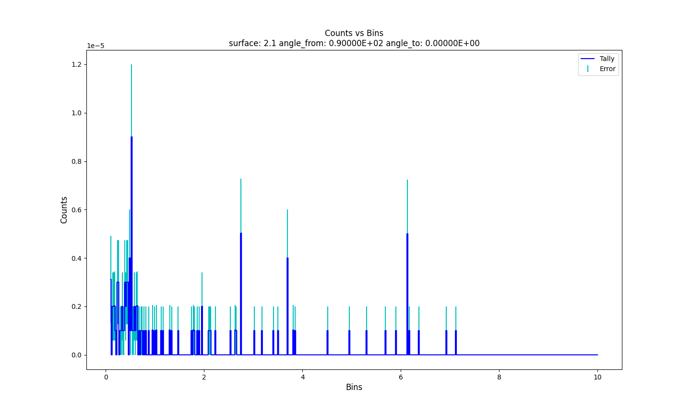
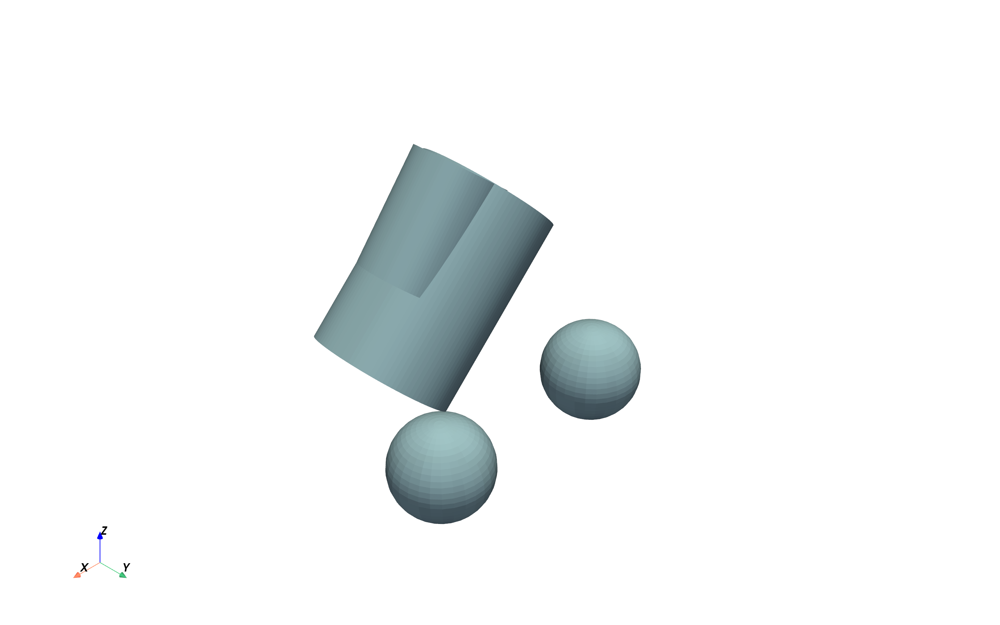

# "Do" Examples

PyMCNP enables common workflows using ``pyvista``, ``pandas``, ``subprocesss``, ``matplotlib``, and ``difflib``.

## Checking INP Files

Code:

```{eval-rst}
.. literalinclude:: ../../../examples/do_check.py
   :language: python
```

## Converting OUTP Files

Code:

```{eval-rst}
.. literalinclude:: ../../../examples/do_convert.py
   :language: python
```

## Plotting OUTP Files

Code:

```{eval-rst}
.. literalinclude:: ../../../examples/do_plot.py
   :language: python
```

Output:



## Running INP Files

Code:

```{eval-rst}
.. literalinclude:: ../../../examples/do_run.py
   :language: python
```

## Visualizing INP Files

Code:

```{eval-rst}
.. literalinclude:: ../../../examples/do_visualize.py
   :language: python
```

Output:



## Parameter Scan

Code:

```{eval-rst}
.. literalinclude:: ../../../examples/do_parameter_scan.py
   :language: python
```
